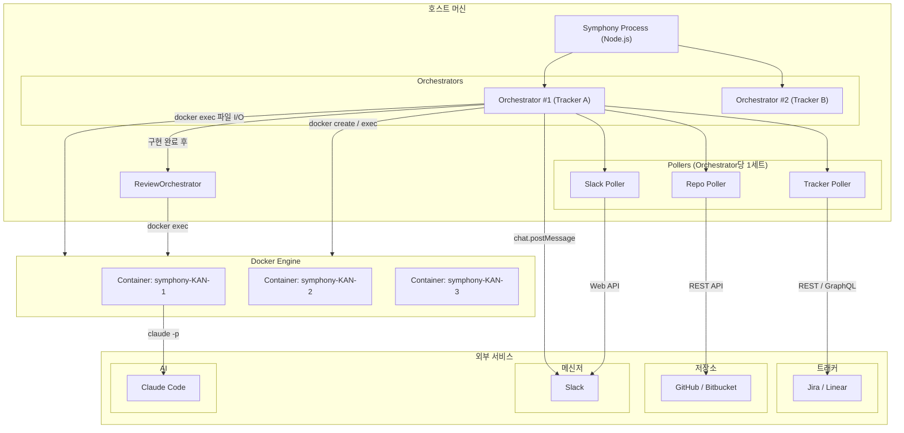
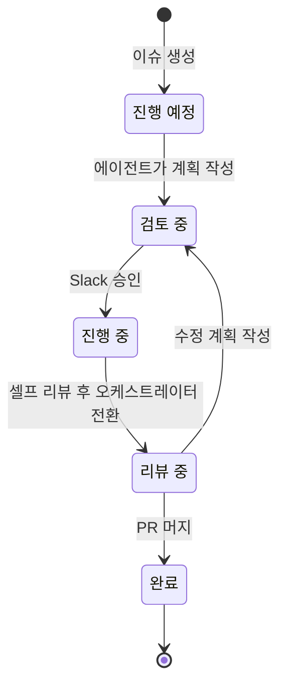
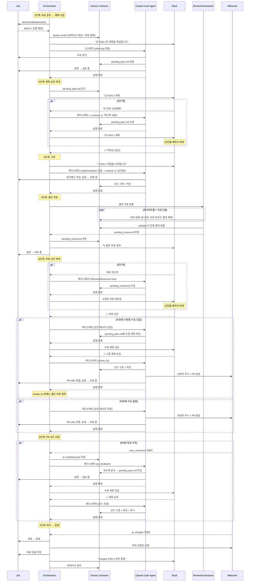
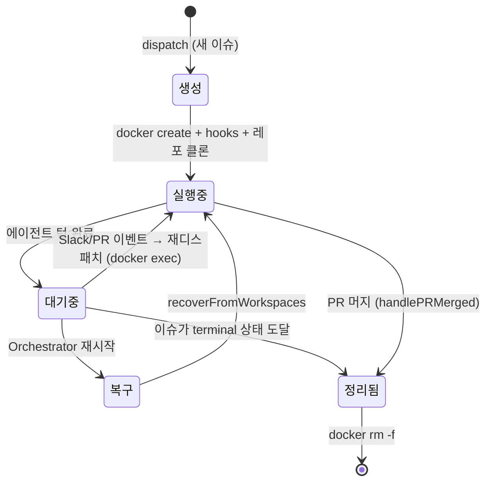
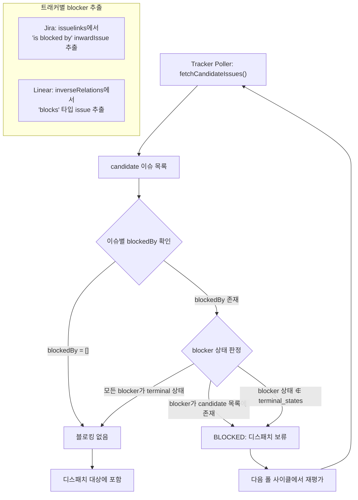

# Symphony Architecture

AI 에이전트 오케스트레이션 시스템. 이슈 트래커(Jira/Linear)의 이슈를 폴링하고, Docker 컨테이너에서 AI 에이전트(Claude Code)를 실행하여 자율적으로 코드를 작성하고, Slack을 통해 사람의 승인/피드백을 받으며, 셀프 리뷰를 거쳐 PR을 생성하고 리뷰 피드백을 처리한다.

---

## 1. 시스템 배치도



**구성 요소:**

| 구성 요소 | 역할 |
|-----------|------|
| **Symphony Process** | Node.js 단일 프로세스. 모든 Orchestrator를 생성하고 실행 |
| **Orchestrator** | 트래커 1개당 1개. 3개의 폴러를 관리하고, 이벤트에 따라 에이전트를 디스패치하며, 에이전트 완료 후 `.symphony/` 파일을 확인하여 후처리(Slack 전송, 셀프 리뷰 트리거) 수행 |
| **Tracker Poller** | Jira/Linear에서 활성 상태 이슈를 주기적으로 조회하여 새 이슈를 감지 |
| **Repo Poller** | GitHub/Bitbucket에서 열린 PR을 주기적으로 조회하여 새 댓글(`new_comments`) 및 머지(`pr_merged`) 이벤트를 감지 |
| **Slack Poller** | 감시 중인 Slack 스레드에서 사용자 답글과 ✅ 리액션을 감지 |
| **ReviewOrchestrator** | 멀티 에이전트 × N 라운드 셀프 리뷰 실행 후 validator가 결과를 취합 |
| **Docker Container** | 이슈당 1개. 에이전트가 코드를 작성하는 격리된 작업 공간. 오케스트레이터는 `docker exec`로 컨테이너 내부 파일을 읽고/쓰며, 에이전트도 `docker exec`로 컨테이너 안에서 실행 |

---

## 2. 소스 구조

```
src/
├── index.ts                 # 엔트리포인트: CLI 파싱, config 로드, Orchestrator 생성
├── orchestrator.ts          # 핵심: 폴링 루프, 디스패치, 이벤트 핸들링, 상태 관리
├── agent-runner.ts          # 에이전트 실행 (워크스페이스 생성 → 프롬프트 빌드 → CLI 실행)
├── prompt-builder.ts        # WORKFLOW.md Liquid 템플릿 렌더링
├── cost-tracker.ts          # 이슈별 비용/토큰 누적 추적
├── fetch-retry.ts           # HTTP fetch + 재시도 (429/5xx/rate limit)
├── types.ts                 # 공통 타입 (Issue, TrackerClient, AgentBackend 등)
│
├── config/
│   ├── schema.ts            # Zod 설정 스키마 (YAML front-matter 검증)
│   └── loader.ts            # WORKFLOW.md 파싱 (YAML + Liquid 분리)
│
├── agent/
│   ├── factory.ts           # 에이전트 백엔드 팩토리
│   ├── claude.ts            # Claude Code CLI 백엔드
│   └── codex.ts             # Codex 백엔드
│
├── workspace/
│   ├── io.ts                # WorkspaceIO / WorkspaceBackend 팩토리
│   ├── docker.ts            # Docker 컨테이너 생성/재사용/정리
│   ├── docker-io.ts         # Docker 컨테이너 내 파일 I/O (docker exec 기반)
│   ├── local.ts             # 로컬 디렉토리 워크스페이스
│   └── local-io.ts          # 로컬 파일 I/O
│
├── tracker/
│   ├── poller.ts            # 트래커 폴러
│   ├── jira.ts              # Jira Cloud REST API 클라이언트
│   └── linear.ts            # Linear GraphQL 클라이언트
│
├── repository/
│   ├── poller.ts            # PR 이벤트 감지 (댓글, 머지)
│   ├── factory.ts           # 저장소 클라이언트 팩토리
│   ├── github.ts            # GitHub REST API 클라이언트
│   └── bitbucket.ts         # Bitbucket Cloud API 클라이언트
│
├── review/
│   ├── orchestrator.ts      # 셀프 리뷰 오케스트레이터
│   ├── claude-review.ts     # Claude 리뷰 백엔드
│   ├── codex-review.ts      # Codex 리뷰 백엔드
│   ├── prompt.ts            # 리뷰 프롬프트 생성
│   └── types.ts             # 리뷰 타입
│
└── slack/
    ├── poller.ts            # Slack 스레드 폴링
    └── notifier.ts          # Slack 메시지 전송
```

---

## 3. 이슈 상태 라이프사이클



**상태별 주체:**

| 상태 전환 | 주체 | 트리거 |
|-----------|------|--------|
| 진행 예정 → 검토 중 | 에이전트 | 계획 작성 완료 |
| 검토 중 → 진행 중 | 에이전트 | Slack 승인 수신 |
| 진행 중 → 리뷰 중 | **오케스트레이터** | 셀프 리뷰 결과를 Slack에 전송 후 전환 |
| 리뷰 중 → 리뷰 중 | 에이전트 | 셀프 리뷰 피드백 수신 → 리뷰 수정 후 오케스트레이터가 재전송 |
| 리뷰 중 → 검토 중 | 에이전트 | 셀프 리뷰 승인 → 수정 계획 작성 (수정할 이슈 있을 때) |
| 리뷰 중 → 검토 중 | 에이전트 | PR 댓글 도착 → 수정 계획 작성 |
| 리뷰 중 → 완료 | **오케스트레이터** | PR 머지 감지 |

---

## 4. 메인 워크플로우



---

## 5. 컨테이너 라이프사이클



**재디스패치 시 컨테이너를 재사용**한다. 새 컨테이너를 만들지 않고 기존 컨테이너에서 `docker exec`로 에이전트를 다시 실행한다.

---

## 6. 안정성 메커니즘

### API Rate Limit 재시도

모든 외부 API 호출은 `fetchWithRetry`를 통해 자동 재시도된다.

| API | 감지 방식 | 재시도 전략 |
|-----|-----------|------------|
| **GitHub** | 403 + `x-ratelimit-remaining: 0` | `x-ratelimit-reset` 타임스탬프까지 대기 |
| **Jira** | 429 + `Retry-After` 헤더 | Retry-After 값 존중 |
| **Linear** | 200 + GraphQL `RATELIMITED` 에러코드 | 지수 백오프 (1s, 2s, 4s) |
| **Slack** | 429 + `Retry-After` 헤더 | Retry-After 값 존중 |
| **공통** | 5xx 서버 에러 | 지수 백오프 (최대 30초) |

### 에이전트 자동 재시도

에이전트 실패 시 이슈가 아직 `active_states`에 있고 재시도 횟수 < `max_retries` (기본 2)이면 지수 백오프 후 재디스패치.

### Stale Agent Timeout

매 폴 사이클마다 4시간 이상 실행 중인 에이전트를 강제 종료 (`pruneStaleAgents`).

### Turn Timeout

에이전트 턴당 `turn_timeout_ms` (기본 1시간) 초과 시 SIGTERM으로 프로세스 종료.

### 이슈 블로킹 (Blocked-By)

트래커의 이슈 링크/관계를 통해 블로킹 의존성을 자동 감지한다. 블로커 이슈가 아직 완료되지 않았으면 해당 이슈의 디스패치를 보류한다.

**트래커별 감지 방식:**

| 트래커 | 데이터 소스 | 감지 조건 |
|--------|------------|-----------|
| **Jira** | `issuelinks[].type.inward` | `"blocked by"` 문자열 포함 시 `inwardIssue`를 blocker로 추출 |
| **Linear** | `inverseRelations[].type` | `"blocks"` 타입인 관계의 소스 이슈를 blocker로 추출 |

**디스패치 차단 판정 (`isBlocked`):**

blocker 중 하나라도 다음 조건을 만족하면 이슈를 blocked로 판정하여 디스패치하지 않는다:
- blocker가 현재 candidate 목록(활성 이슈)에 포함되어 있거나
- blocker의 상태가 `terminal_states`에 해당하지 않는 경우

blocker가 모두 terminal 상태(완료/취소)에 도달하면 자동으로 블로킹이 해제되어 다음 폴 사이클에서 디스패치된다.



### 이벤트 큐잉

에이전트 실행 중 PR 댓글 도착 시 큐에 저장. 에이전트 완료 후 `drainCommentQueue`로 처리.

---

## 7. 컨테이너 내부 파일 규약

에이전트와 Orchestrator가 `.symphony/` 디렉토리의 파일로 통신한다.

| 경로 | 방향 | 설명 |
|------|------|------|
| `pending_plan.md` | Agent → OC | 에이전트가 작성한 계획. OC가 읽고 Slack 전송 후 비움 |
| `pending_review.md` | OC → Agent | ReviewOrchestrator가 생성한 리뷰 결과. 에이전트가 피드백 시 수정 가능 |
| `question.md` | Agent → OC | 에이전트가 작성한 질문. OC가 읽고 Slack 전송 후 비움 |
| `pr_feedback.json` | OC → Agent | PR 댓글 목록. 에이전트가 읽고 수정 계획 수립 |
| `pr_created.json` | Agent → OC | 에이전트가 PR 생성 후 작성. OC가 읽고 Slack 알림 전송 |
| `review_sent` | OC 내부 | 리뷰 전송 여부 마커. 리뷰 응답과 계획 응답을 구분하는 데 사용 |

**에이전트에게 메시지 전달 방식:** `--continue -p "메시지"` 로 직접 전달. 파일 기반이 아님.

---

## 8. 설정 레퍼런스

WORKFLOW.md 파일의 YAML front-matter로 설정한다:

```yaml
---
# ── 워크스페이스 백엔드 ────────────────────────────────────────────────────
# 'docker': 이슈별 Docker 컨테이너 생성 (격리, 권장)
# 'local':  호스트 디렉토리에 이슈별 폴더 생성 (간단하지만 격리 없음)
workspace_backend: docker

# ── 트래커 ────────────────────────────────────────────────────────────────
# 여러 트래커를 동시에 실행 가능. tracker: (단수) 표기도 허용.
trackers:

  # Jira 트래커
  - kind: jira
    project_key: KAN                          # Jira 프로젝트 키
    host: https://your-domain.atlassian.net   # Jira Cloud 호스트
    email: $JIRA_EMAIL                        # Atlassian 계정 이메일
    api_token: $JIRA_API_TOKEN                # Atlassian API 토큰

    states:                      # 트래커 상태명 → Symphony 시맨틱 매핑 (필수)
      planning: 진행 예정          # 에이전트가 계획 작성 → plan_review로 전환
      plan_review: 검토 중        # Slack 승인 대기 상태
      in_progress: 진행 중        # 구현 진행 중
      in_review: 리뷰 중          # 셀프 리뷰 또는 PR 코드 리뷰 대기
      done: 완료                  # terminal 상태 (자동 cleanup 트리거)
      canceled: 취소              # terminal 상태 (선택사항)

    poll_interval_ms: 60000      # 이슈 폴링 주기 (ms). Jira는 rate limit 엄격 → 60초 권장
    # assignee: john@example.com # 특정 담당자 이슈만 처리 (선택사항)
    # active_states: []          # 직접 지정 시 states.planning + states.in_progress 대신 사용
    # terminal_states: []        # 직접 지정 시 states.done + states.canceled 대신 사용

    repository:                  # 저장소 연동 (선택사항)
      kind: bitbucket
      workspace: my-workspace    # Bitbucket 워크스페이스 슬러그
      repo_slug: my-repo         # 저장소 슬러그
      email: $BITBUCKET_EMAIL    # Atlassian 계정 이메일 (Basic 인증)
      api_token: $BITBUCKET_API_TOKEN
      poll_interval_ms: 30000    # PR 이벤트 폴링 주기 (ms)
      # pr_label_filter: symphony  # 이 문자열이 브랜치명에 포함된 PR만 처리 (선택사항)
      event_source: polling      # 'polling' | 'webhook'
      # webhook_secret: $BITBUCKET_WEBHOOK_SECRET  # webhook 사용 시 필요

      hooks:                     # 워크스페이스 라이프사이클 훅 (선택사항, 셸 스크립트)
        # after_create: |        # 컨테이너 생성 후, 레포 클론 전 실행
        #   echo "container ready"
        # after_clone: |         # 레포 클론 후 실행 (의존성 설치 등)
        #   npm ci
        # before_run: |          # 매 에이전트 실행 직전 실행
        #   git fetch origin
        # after_run: |           # 매 에이전트 실행 직후 실행
        #   rm -rf node_modules/.cache
        # before_remove: |       # 워크스페이스 정리 직전 실행
        #   echo "cleanup"
        timeout_ms: 300000       # 훅 실행 타임아웃 (ms, 기본 5분)

  # Linear 트래커 (예시)
  # - kind: linear
  #   project_slug: my-project   # Linear 프로젝트 슬러그
  #   api_key: $LINEAR_API_KEY
  #   states:
  #     planning: Todo
  #     plan_review: In Review
  #     in_progress: In Progress
  #     in_review: In Review
  #     done: Done
  #   poll_interval_ms: 30000
  #   repository:
  #     kind: github
  #     repo: owner/repo          # GitHub 저장소 (owner/repo 형식)
  #     token: $GITHUB_TOKEN
  #     poll_interval_ms: 30000
  #     pr_label_filter: symphony  # 이 라벨이 붙은 PR만 처리
  #     event_source: polling

# ── 에이전트 ──────────────────────────────────────────────────────────────
# backends: 이슈당 순서대로 실행. trigger 조건으로 특정 이슈에만 특정 에이전트 적용 가능.
agents:
  max_concurrent: 10             # 전체 동시 실행 에이전트 최대 수
  retry_backoff_ms: 5000         # 재시도 기본 백오프 (ms). 지수 증가: 5s, 10s, 20s...
  max_retries: 2                 # 에이전트 실패 시 자동 재시도 횟수 (기본 2회)

  # ── 셀프 리뷰 ──────────────────────────────────────────────
  review:
    rounds: 2                    # 에이전트당 리뷰 라운드 수 (1~5). 각 라운드는 새 세션
    kinds:                       # 리뷰를 병렬 실행할 에이전트 종류 (backends[].kind 참조)
      - claude

  # ── 백엔드 ─────────────────────────────────────────────────
  backends:
    # Claude Code 에이전트
    - kind: claude
      primary: true              # 메인 에이전트: 계획/구현/리뷰 병합. 미지정 시 첫 번째가 기본값
      # command: claude           # claude 바이너리 경로 (기본값: 'claude')
      models:
        planning: opus            # 계획 수립 시 사용할 모델 (new_issue, 피드백, pr_feedback)
        implementation: sonnet    # 구현 시 사용할 모델 (Slack 승인 후)
      turn_timeout_ms: 3600000    # 에이전트 1회 실행 타임아웃 (ms, 기본 1시간)
      # max_turns: 20             # Claude CLI --max-turns 값 (생략 시 CLI 기본값)
      # max_budget_usd: 5.0       # 턴당 최대 지출 한도 (USD, 선택사항)
      # mcp_config: .mcp.json     # MCP 서버 설정 파일 경로 (선택사항)
      # allowed_tools: []         # 허용할 툴 목록 (빈 배열 = 모든 툴 허용)
      # trigger:                  # 이 에이전트를 실행할 조건 (선택사항, 생략 시 항상 실행)
      #   issue_labels: [backend] # 이슈에 이 라벨이 하나 이상 있을 때만 실행
      #   pr_labels: [symphony]   # PR에 이 라벨이 있을 때만 실행 (PR 트리거 dispatch 한정)

    # Codex 에이전트 (예시)
    # - kind: codex
    #   command: codex            # codex 바이너리 경로 (기본값: 'codex')
    #   max_turns: 20             # 오케스트레이터가 관리하는 최대 턴 수
    #   approval_policy: never    # Codex 승인 정책 ('never', 'on-failure' 등)
    #   trigger:
    #     pr_labels: [security]   # security 라벨 PR 피드백에만 실행

# ── 워크스페이스 ──────────────────────────────────────────────────────────
workspace:
  root: ./symphony-workspaces    # 이슈별 워크스페이스 루트 디렉토리

# ── SSH 원격 워커 ─────────────────────────────────────────────────────────
# 설정 시 로컬 대신 SSH 호스트에서 에이전트 실행. 순서대로 시도, 실패 시 다음 호스트.
# worker:
#   ssh_hosts:
#     - user@worker1.example.com
#     - user@worker2.example.com

# ── Docker 백엔드 (workspace_backend: docker 시 사용) ───────────────────
docker:
  image: symphony-worker:latest  # 에이전트 실행에 사용할 Docker 이미지
  # auth_mount: ~/.claude        # 호스트 경로를 컨테이너 /root/.claude에 read-only 마운트
  # memory: 4g                   # 컨테이너 메모리 제한 (docker --memory)
  # cpus: "2"                    # 컨테이너 CPU 제한 (docker --cpus)
  # env:                         # 컨테이너에 주입할 추가 환경변수
  #   MY_SECRET: $MY_SECRET

# ── Slack 승인 워크플로우 ─────────────────────────────────────────────────
slack:
  bot_token: $SLACK_BOT_TOKEN    # Slack Bot OAuth 토큰 (xoxb-...)
  channel: $SLACK_CHANNEL_ID     # 알림을 보낼 채널 ID (C로 시작)

# ── 대시보드 (TUI) ────────────────────────────────────────────────────────
# observability:
#   dashboard: true              # TTY에서 neo-blessed 대시보드 활성화 (기본 true, DASHBOARD=0으로 비활성화)
#   refresh_interval_ms: 2000    # 대시보드 갱신 주기 (ms)

# ── 내부 HTTP 서버 ────────────────────────────────────────────────────────
# server:
#   port: 4000                   # HTTP 서버 포트 (헬스체크, webhook 수신 등)
#   host: 0.0.0.0                # 바인딩 주소
---

# 여기부터 Liquid 템플릿 (에이전트 프롬프트)
You are working on {{ issue.identifier }}: {{ issue.title }}
...
```

### 환경변수

| 변수 | 필수 | 설명 |
|------|------|------|
| `ANTHROPIC_API_KEY` | Yes | Claude API 인증 |
| `GITHUB_TOKEN` | GitHub 사용 시 | GitHub API + git 인증 |
| `JIRA_EMAIL` | Jira 사용 시 | Jira Basic 인증 |
| `JIRA_API_TOKEN` | Jira 사용 시 | Jira API 토큰 |
| `LINEAR_API_KEY` | Linear 사용 시 | Linear API 키 |
| `SLACK_BOT_TOKEN` | Slack 사용 시 | Slack Bot OAuth 토큰 |
| `SLACK_CHANNEL_ID` | Slack 사용 시 | 알림 채널 |
| `BITBUCKET_API_TOKEN` | Bitbucket 사용 시 | Bitbucket API 토큰 |
| `BITBUCKET_EMAIL` | Bitbucket 사용 시 | Atlassian 계정 이메일 |
