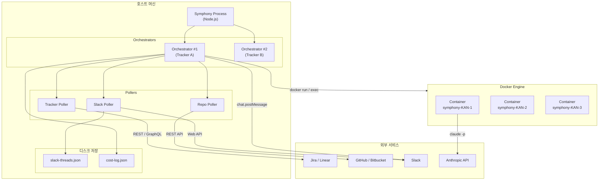
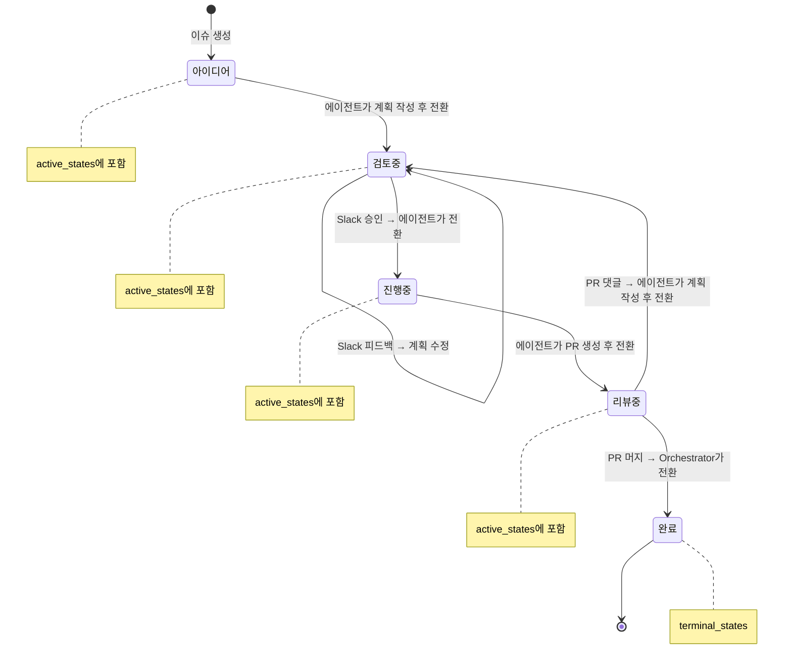
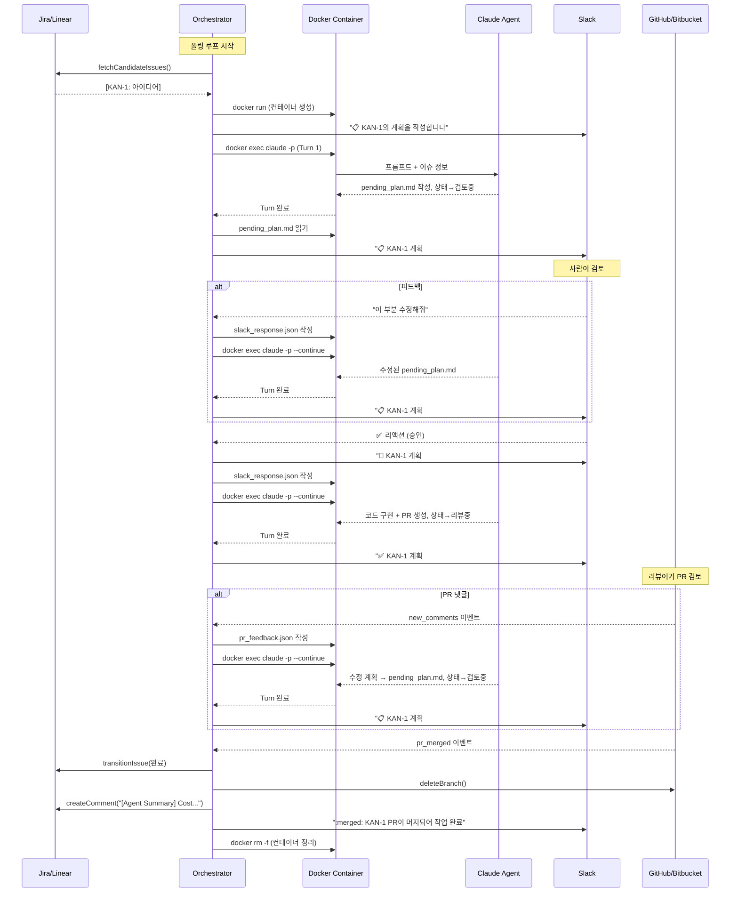
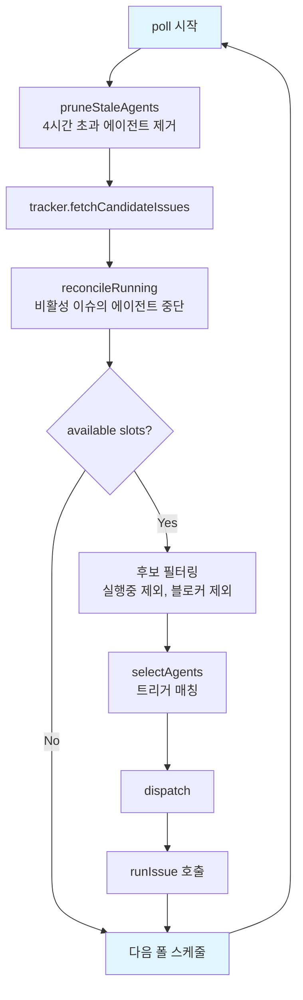
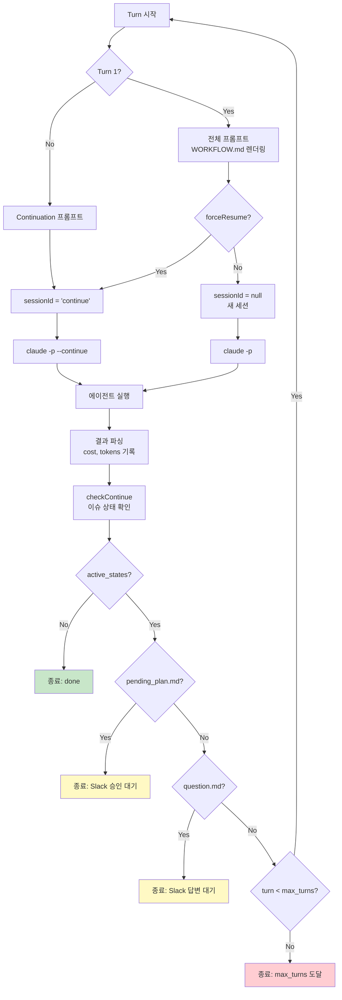
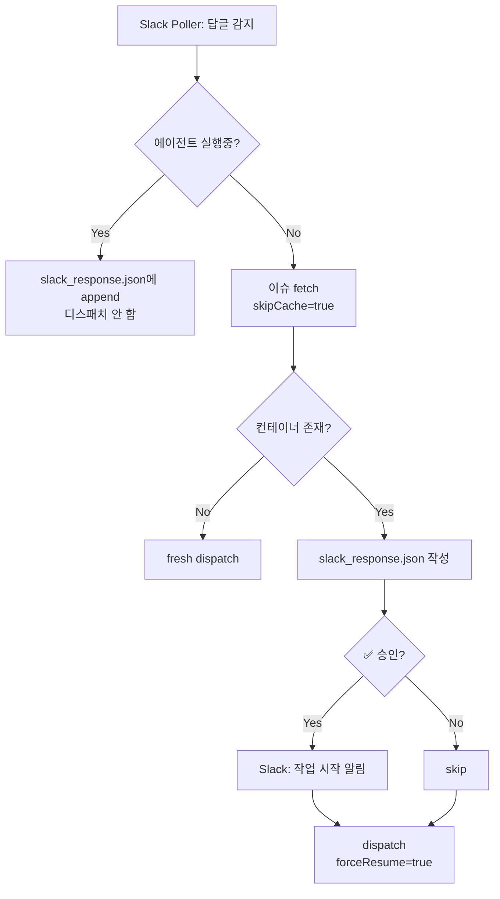
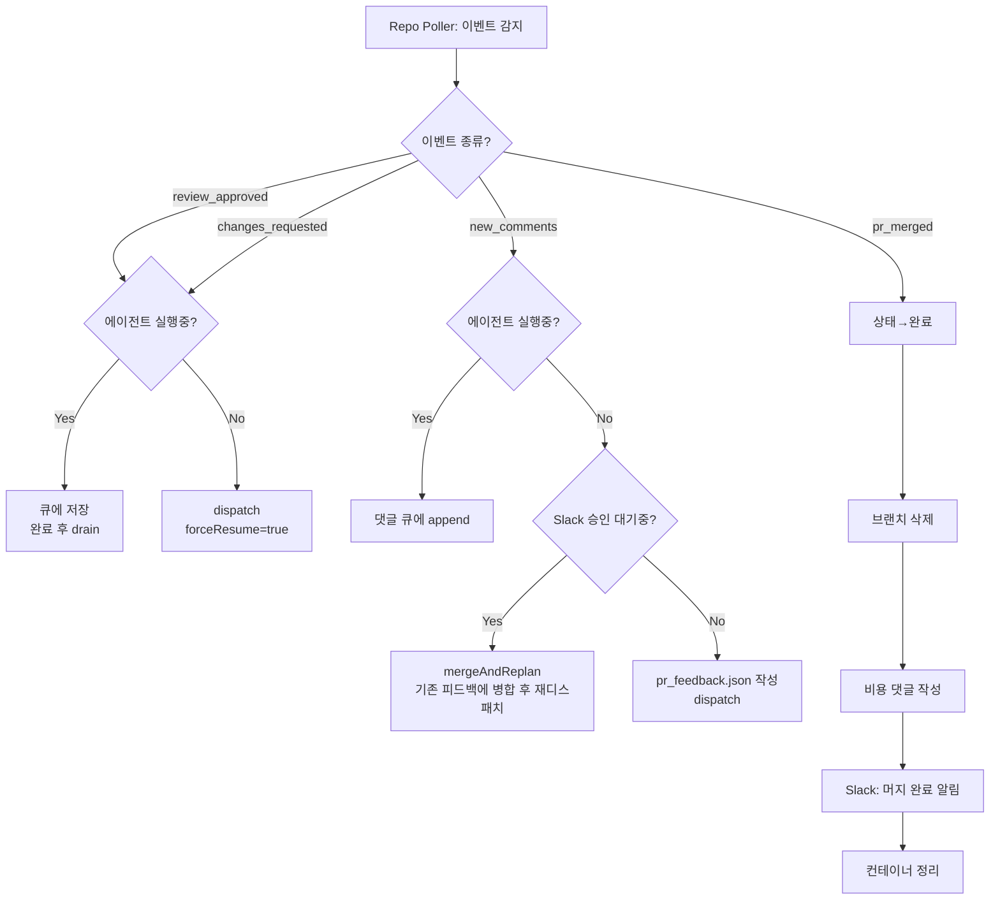
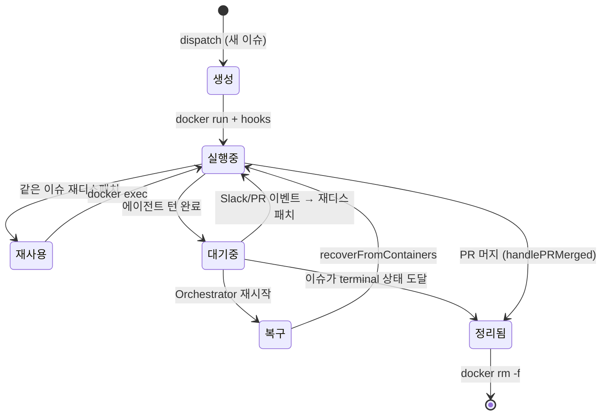

# Symphony Architecture

AI 에이전트 오케스트레이션 시스템. 이슈 트래커(Jira/Linear)의 이슈를 폴링하고, Docker 컨테이너에서 AI 에이전트(Claude/Codex)를 실행하여 자율적으로 코드를 작성하고, Slack을 통해 사람의 승인/피드백을 받으며, PR을 생성하고 리뷰 피드백을 처리한다.

---

## 1. 시스템 배치도



**구성 요소:**

| 구성 요소 | 역할 |
|-----------|------|
| **Symphony Process** | Node.js 단일 프로세스. 모든 Orchestrator를 생성하고 실행 |
| **Orchestrator** | 트래커 1개당 1개. 폴링, 디스패치, 이벤트 처리를 총괄 |
| **Tracker Poller** | Jira/Linear에서 active 이슈를 주기적으로 조회 |
| **Repo Poller** | GitHub/Bitbucket에서 PR 리뷰, 댓글, 머지를 감지 |
| **Slack Poller** | Slack 스레드에서 사람의 답글과 ✅ 리액션을 감지 |
| **Docker Container** | 이슈당 1개. 에이전트가 코드를 작성하는 격리된 작업 공간 |

---

## 2. 소스 구조

```
src/
├── index.ts                 # 엔트리포인트: CLI 파싱, config 로드, Orchestrator 생성
├── orchestrator.ts          # 핵심: 폴링 루프, 디스패치, 이벤트 핸들링, 상태 관리
├── agent-runner.ts          # 에이전트 멀티턴 실행 루프
├── prompt-builder.ts        # WORKFLOW.md Liquid 템플릿 렌더링
├── cost-tracker.ts          # 이슈별 비용/토큰 누적 추적
├── fetch-retry.ts           # HTTP fetch + 재시도 (429/5xx/rate limit)
├── utils.ts                 # 유틸리티 (parseDate, issueCtx)
├── shell-utils.ts           # 셸 이스케이프
├── spawn-async.ts           # 프로세스 스폰 래퍼
├── logger.ts                # 로거
├── types.ts                 # 공통 타입 (Issue, TrackerClient, AgentBackend 등)
│
├── config/
│   ├── schema.ts            # Zod 설정 스키마 (YAML front-matter 검증)
│   └── loader.ts            # WORKFLOW.md 파싱 (YAML + Liquid 분리)
│
├── agent/
│   ├── claude.ts            # Claude Code CLI 백엔드
│   └── codex.ts             # Codex JSON-RPC 백엔드
│
├── workspace/
│   ├── docker.ts            # Docker 컨테이너 생성/재사용/정리
│   └── local.ts             # 로컬 디렉토리 워크스페이스
│
├── tracker/
│   ├── jira.ts              # Jira Cloud REST API 클라이언트
│   └── linear.ts            # Linear GraphQL 클라이언트
│
├── repository/
│   ├── poller.ts            # PR 이벤트 감지 (리뷰, 댓글, 머지)
│   ├── github.ts            # GitHub REST API 클라이언트
│   ├── bitbucket.ts         # Bitbucket Cloud API 클라이언트
│   └── utils.ts             # 브랜치명에서 이슈 식별자 추출
│
└── slack/
    ├── poller.ts            # Slack 스레드 폴링 + 디스크 저장
    └── notifier.ts          # Slack 메시지 전송
```

---

## 3. 이슈 상태 라이프사이클



**상태별 주체:**

| 상태 전환 | 주체 | 트리거 |
|-----------|------|--------|
| 아이디어 → 검토 중 | 에이전트 | 계획 작성 완료 |
| 검토 중 → 진행 중 | 에이전트 | Slack 승인 수신 |
| 진행 중 → 리뷰 중 | 에이전트 | PR 생성 완료 |
| 리뷰 중 → 검토 중 | 에이전트 | PR 댓글에 대한 수정 계획 작성 |
| 리뷰 중 → 완료 | **Orchestrator** | PR 머지 감지 |

---

## 4. 메인 워크플로우



---

## 5. 폴링 & 디스패치 루프



**폴링 주기:** `poll_interval_ms` 설정 (기본 30초)

**동시성 제어:** `max_concurrent_agents` 설정 (기본 10)

---

## 6. 에이전트 턴 루프



**세션 지속성:** Claude는 컨테이너 내 `/workspace/.claude`에 대화 이력을 저장. `--continue` 플래그로 이전 대화를 이어받음.

---

## 7. 이벤트 처리 경로

### 7.1 Slack 응답



### 7.2 PR 이벤트



---

## 8. 컨테이너 라이프사이클



### 컨테이너 생성 상세

```
docker run -d
  --name symphony-{identifier}
  --workdir /workspace
  --memory {config}  --cpus {config}
  -e ANTHROPIC_API_KEY=...
  -e GITHUB_TOKEN=...
  {image}
  sleep infinity
    ↓
injectClaudeCredentials()    # macOS Keychain 또는 파일에서 읽어 컨테이너에 주입
injectGitCredentials()       # credential.helper store 설정
    ↓
after_create hook            # git clone, npm ci 등
```

### 크래시 복구 (recoverFromContainers)

Orchestrator 재시작 시:
1. `docker ps --filter name=symphony-` 로 살아있는 컨테이너 조회
2. 컨테이너 이름에서 이슈 identifier 역추출
3. 트래커에서 이슈 상태 조회
4. `active_states`에 있으면 `forceResume: true`로 재디스패치
5. 아니면 skip (다음 `cleanupTerminalWorkspace`에서 정리)

---

## 9. 안정성 메커니즘

### 9.1 API Rate Limit 재시도

모든 외부 API 호출은 `fetchWithRetry`를 통해 자동 재시도됩니다.

| API | 감지 방식 | 재시도 전략 |
|-----|-----------|------------|
| **GitHub** | 403 + `x-ratelimit-remaining: 0` | `x-ratelimit-reset` 타임스탬프까지 대기 |
| **Jira** | 429 + `Retry-After` 헤더 | Retry-After 값 존중 |
| **Linear** | 200 + GraphQL `RATELIMITED` 에러코드 | 지수 백오프 (1s, 2s, 4s) |
| **Slack** | 429 + `Retry-After` 헤더 | Retry-After 값 존중 |
| **공통** | 5xx 서버 에러 | 지수 백오프 (최대 30초) |

최대 재시도: 3회. 실패 시 응답을 그대로 반환하여 호출자가 처리.

### 9.2 에이전트 자동 재시도

에이전트가 실패하면:
1. 이슈 상태를 트래커에서 재확인
2. 아직 `active_states`에 있고 재시도 횟수 < `max_retries` (기본 2) 이면
3. 지수 백오프 (`retry_backoff_ms * 2^attempt`) 후 재디스패치
4. 모든 재시도 소진 시 `failedCount++`

### 9.3 Stale Agent Timeout

매 폴 사이클마다 4시간 이상 실행 중인 에이전트를 강제 종료 (`pruneStaleAgents`).

### 9.4 Turn Timeout

에이전트 턴당 `turn_timeout_ms` (기본 1시간) 초과 시 SIGTERM으로 프로세스 종료.

### 9.5 이벤트 큐잉

에이전트 실행 중 PR 댓글/리뷰 도착 시 큐에 저장. 에이전트 완료 후 `drainCommentQueue` / `drainReviewQueue`로 처리.

---

## 10. 비용 추적

### 기록 흐름

```
에이전트 턴 완료
  → ClaudeBackend.parseResult(): cost, tokensTotal 추출
  → onTurnComplete 콜백
  → CostTracker.record(identifier, cost, tokens)
  → cost-log.json에 누적 저장
```

### 저장 형식 (cost-log.json)

```json
{
  "KAN-1": {
    "costUsd": 0.4523,
    "tokens": 125000,
    "turns": 8,
    "lastUpdated": "2026-03-19T10:30:00.000Z"
  }
}
```

### 완료 시 댓글

이슈가 terminal 상태에 도달하면 (`cleanupTerminalWorkspace`):

```
[Agent Summary] Cost: $0.4523 | Tokens: 125,000 | Turns: 8
```

이 댓글이 Jira/Linear 이슈에 자동으로 작성됩니다.

---

## 11. 설정 레퍼런스

WORKFLOW.md 파일의 YAML front-matter로 설정합니다:

```yaml
---
workspace_backend: docker          # 'docker' | 'local'

trackers:
  - kind: jira                     # 'jira' | 'linear'
    project_key: KAN
    host: https://your-domain.atlassian.net
    email: $JIRA_EMAIL
    api_token: $JIRA_API_TOKEN
    active_states:
      - 아이디어
      - 검토 중
      - 진행 중
      - 리뷰 중
    terminal_states:
      - 완료
    poll_interval_ms: 30000
    assignee: me                   # 'me' | account_id | 생략

    repository:                    # 선택사항
      kind: github                 # 'github' | 'bitbucket'
      repo: owner/repo
      token: $GITHUB_TOKEN
      pr_label_filter: symphony
      poll_interval_ms: 30000

agents:
  - kind: claude                   # 'claude' | 'codex'
    command: claude
    max_turns: 20
    max_budget_usd: 5.0            # 선택사항
    turn_timeout_ms: 3600000       # 1시간
    mcp_config: mcp.json           # 선택사항
    allowed_tools: []              # 빈 배열 = 전체 허용
    trigger:                       # 선택사항
      issue_labels: [backend]
      pr_labels: [symphony]

agent:
  max_concurrent_agents: 10
  retry_backoff_ms: 5000
  max_retries: 2

workspace:
  root: ./symphony-workspaces      # local 백엔드용

docker:
  image: symphony-worker:latest
  memory: 4g
  cpus: "2"
  auth_mount: ~/.claude            # 선택사항
  env:                             # 추가 환경변수
    NODE_ENV: production

hooks:
  after_create: |
    git clone https://github.com/owner/repo.git /workspace
    cd /workspace && npm ci
  before_run: ""
  after_run: ""
  before_remove: ""
  timeout_ms: 300000               # 5분

slack:
  bot_token: $SLACK_BOT_TOKEN
  channel: $SLACK_CHANNEL_ID
  poll_interval_ms: 10000

observability:
  dashboard: true
  refresh_interval_ms: 2000

server:
  port: 4000
  host: 0.0.0.0
---

# 여기부터 Liquid 템플릿 (에이전트 프롬프트)
You are working on {{ issue.identifier }}: {{ issue.title }}
...
```

### 환경변수

| 변수 | 필수 | 설명 |
|------|------|------|
| `ANTHROPIC_API_KEY` | Yes | Claude API 인증 |
| `GITHUB_TOKEN` | GitHub 사용 시 | GitHub API + git 인증 |
| `JIRA_EMAIL` | Jira 사용 시 | Jira Basic 인증 |
| `JIRA_API_TOKEN` | Jira 사용 시 | Jira API 토큰 |
| `LINEAR_API_KEY` | Linear 사용 시 | Linear API 키 |
| `SLACK_BOT_TOKEN` | Slack 사용 시 | Slack Bot OAuth 토큰 |
| `SLACK_CHANNEL_ID` | Slack 사용 시 | 알림 채널 |
| `BITBUCKET_API_TOKEN` | Bitbucket 사용 시 | Bitbucket API 토큰 |
| `BITBUCKET_EMAIL` | Bitbucket 사용 시 | Atlassian 계정 이메일 |

---

## 12. 컨테이너 내부 파일 규약

에이전트와 Orchestrator가 주고받는 파일들:

| 경로 | 방향 | 설명 |
|------|------|------|
| `/workspace/.symphony/pending_plan.md` | Agent → OC | 에이전트가 작성한 계획. OC가 읽고 Slack 전송 후 비움 |
| `/workspace/.symphony/question.md` | Agent → OC | 에이전트가 작성한 질문. OC가 읽고 Slack 전송 후 비움 |
| `/workspace/.symphony/slack_response.json` | OC → Agent | Slack 응답 배열. 에이전트가 읽고 처리 |
| `/workspace/.symphony/pr_feedback.json` | OC → Agent | PR 댓글 목록. 에이전트가 읽고 처리 |
| `/workspace/.claude/` | Agent | Claude 세션 파일 (대화 이력 자동 관리) |
